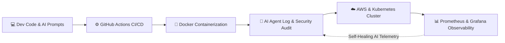

  

  
  
  
  
  

 

> [!NOTE]
> ### 🤖 DEV-AI ENGINEER SPECIFICATIONS
> **Developer:** Konda Balaji Rao &nbsp;|&nbsp; **Role:** DevOps Architect & AI Systems Engineer &nbsp;|&nbsp; **Status:** 🟢 Operational // Available for Impact Roles
> 
> - **☁️ Cloud & DevOps Infrastructure:** Infrastructure as Code (Terraform, Ansible) • Container Orchestration (Docker, Kubernetes, AWS) • Zero-Downtime CI/CD Pipelines • System Observability (Prometheus, Grafana, Nginx)
> - **🧠 Gen AI & LLMOps Engineering:** LLM Orchestration, RAG Pipelines & Autonomous AI Agents • Gen AI Tooling & MLOps Deployment • High-Throughput FastAPI Microservices • Intelligent Log Diagnostics

> [!IMPORTANT]
> **DevOps Rigor × Gen AI Innovation**: I bridge resilient cloud infrastructure with next-generation AI workflows — automating CI/CD delivery while deploying production LLMs, autonomous AI agents, and intelligent telemetry.

> [!TIP]
> **Engineering Philosophy**: *Code for core logic, DevOps for 99.9% system availability, and Gen AI to multiply operational velocity.*

---

## ⚡ Agentic DevOps & AI Architecture Flow

---

## 📊 System Metrics & Performance Telemetry

  <table>
    <tr>
      <td align="center" width="180"><b>⚡ 99.9%</b> <code>CI/CD Pipeline Uptime</code></td>
      <td align="center" width="180"><b>🚀 ~60%</b> <code>Deployment Latency Cut</code></td>
      <td align="center" width="180"><b>🤖 ~75%</b> <code>AI Ops Automation Rate</code></td>
      <td align="center" width="180"><b>🧠 LLMOps / RAG</b> <code>Production Inference</code></td>
      <td align="center" width="180"><b>🔍 95%+</b> <code>System Observability</code></td>
    </tr>
  </table>

---

## 🛠️ Technology Stack & AI Capabilities

<strong>☁️ DevOps, Cloud & Infrastructure Engineering (Primary Foundation)</strong>

 

<strong>🤖 Gen AI Engineering, LLMOps & Machine Learning</strong>

 

<strong>⚡ Backend, High-Concurrency & Microservices</strong>

 

<strong>🛠️ AI Productivity & Developer Accelerators</strong>

 

---

## 🚀 Featured AI & DevOps Systems

  
  
  

### 🐳 [Docker Infrastructure Repository](https://github.com/9046balaji/Docker)
Production-ready containerization architecture, multi-stage Docker builds, microservice orchestration, and deployment blueprints.  
`Focus`: Container Optimization • Cloud Deployment • Multi-stage Builds

### 🫀 [Heart Disease Prediction Engine](https://github.com/9046balaji/Heart)
End-to-end machine learning pipeline for cardiovascular risk assessment, automated model evaluation, and predictive analytics.  
`Focus`: ML Model Engineering • Clinical Data Pipelines • Diagnostic Inference

### 📄 [PDF Workflow & Document AI Toolkit](https://github.com/9046balaji/Pdf-Tools)
Intelligent document extraction, processing automation, and pipeline integration for high-volume PDF workflows.  
`Focus`: Document Intelligence • Automated Workflows • Python Automation

---

## 📜 Certifications & Verified Credentials

<strong>🎓 Click any thumbnail to expand full certificate</strong>

 

  <table>
    <tr>
      <td align="center" width="33%">
        <a href="./certificates/aws_cloud_practitioner.jpg">
            
          <b>AWS Certified Cloud Practitioner</b>
        </a>
      </td>
      <td align="center" width="33%">
        <a href="./certificates/generative_ai.jpg">
            
          <b>Generative AI Specialization</b>
        </a>
      </td>
      <td align="center" width="33%">
        <a href="./certificates/cloud_computing.jpg">
            
          <b>Cloud Computing & Architecture</b>
        </a>
      </td>
    </tr>
    <tr>
      <td align="center" width="33%">
        <a href="./certificates/pwc_launchpad.jpg">
            
          <b>PwC Launchpad Certification</b>
        </a>
      </td>
      <td align="center" width="33%">
        <a href="./certificates/hackathon_achievement.jpg">
            
          <b>Hackathon Excellence Award</b>
        </a>
      </td>
      <td align="center" width="33%">
        <a href="./certificates/pet_exam.jpg">
            
          <b>PET Technical Certification</b>
        </a>
      </td>
    </tr>
  </table>

---

## 🧠 Core Competencies & Dual Discipline Matrix

| ☁️ DevOps & Cloud Infrastructure | 🤖 Gen AI & AI Systems Engineering |
|---|---|
| ⚡ Automated Zero-Downtime CI/CD Pipelines | 🤖 Gen AI Tool Integration & Autonomous Agent Workflows |
| 🐳 Docker Containerization & Kubernetes Clusters | 🧠 LLMOps, RAG Architecture & Model Inference |
| ☁️ AWS Cloud Infrastructure & Terraform/Ansible | 🔍 Intelligent Log Analysis & Self-Healing Telemetry |
| 📊 Prometheus & Grafana Monitoring & Observability | ⚡ High-Concurrency FastAPI Microservices + Celery/Redis |

---

## 📈 System Metrics & GitHub Analytics

  

  

 

  <picture>
    <source media="(prefers-color-scheme: dark)" srcset="https://raw.githubusercontent.com/9046balaji/9046balaji/output/github-snake-dark.svg">
    
  </picture>

---

## 🤝 Let's Connect & Collaborate

I am open to high-impact opportunities in **DevOps Cloud Architecture**, **Gen AI Systems Engineering**, and **LLMOps Automation**.

 

  

