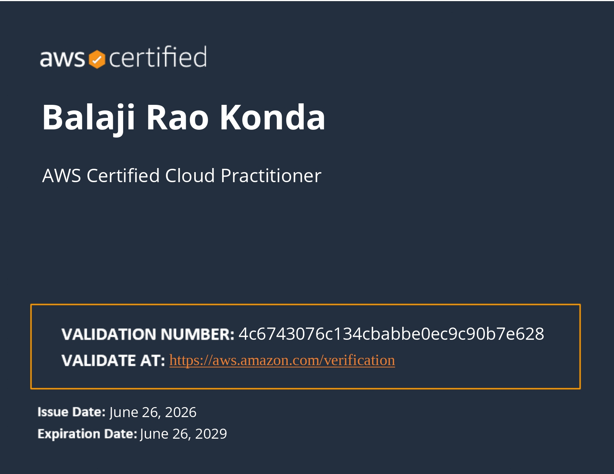
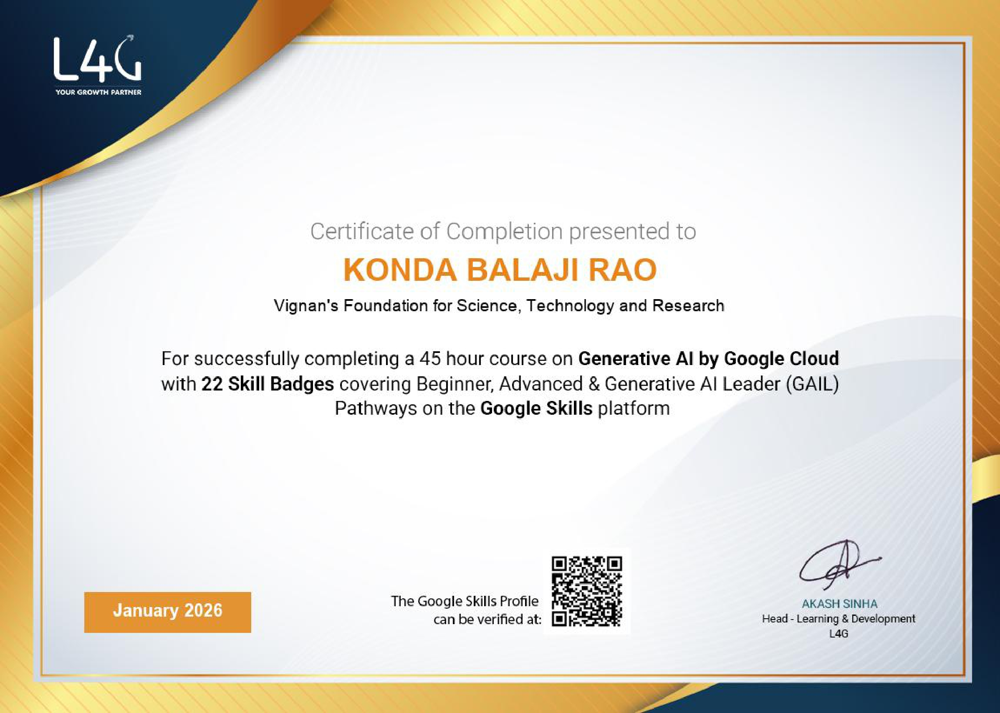
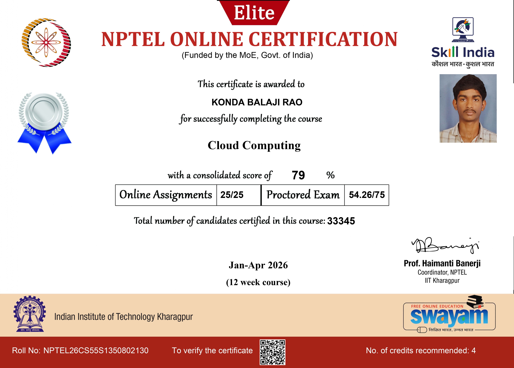
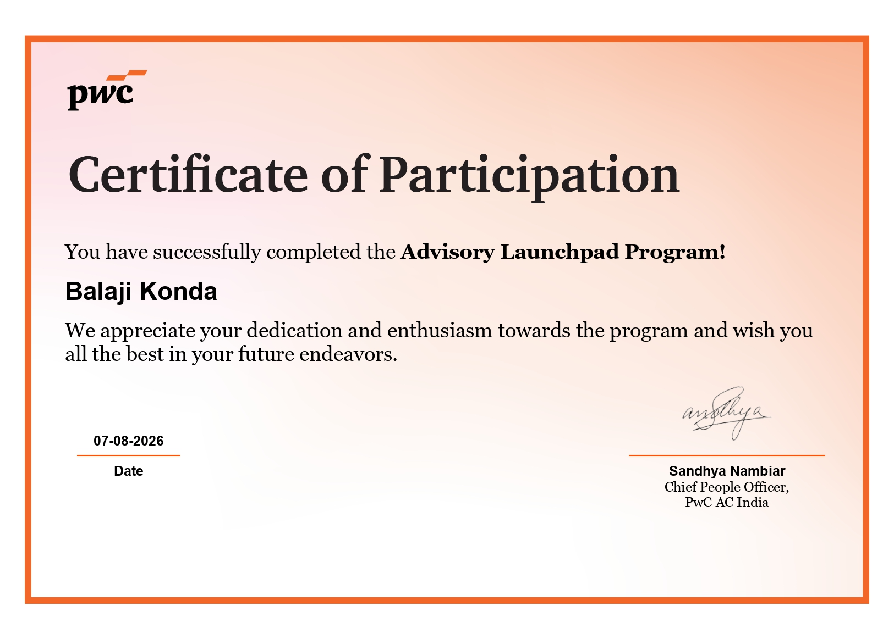
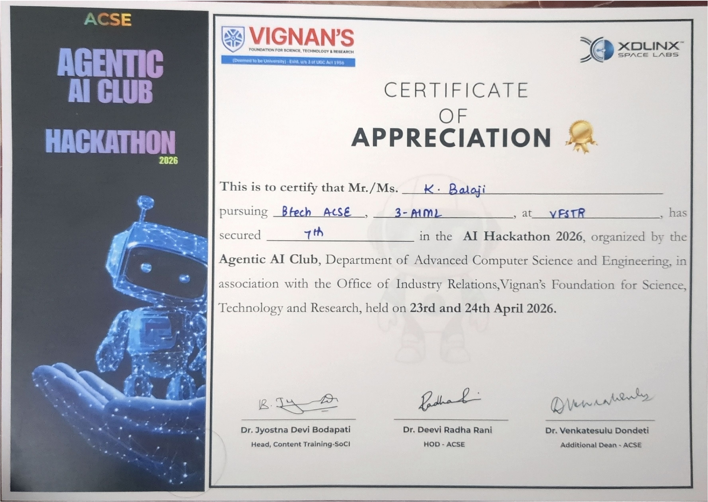

  

  
  
  
  
  

---

## 📌 About Me

Engineering student with a strong focus on **DevOps** and **AI Applications**. I enjoy automating development workflows, containerizing applications, building CI/CD pipelines, and applying modern AI tools to practical engineering challenges.

- ☁️ **DevOps & Cloud:** Building automated CI/CD pipelines, containerizing apps with Docker & Kubernetes, and working with AWS cloud infrastructure.
- 🤖 **AI & ML Engineering:** Developing predictive ML models, experimenting with LLM/GenAI tools, and automating data processing.
- ⚡ **Backend Development:** Writing clean, efficient Python backend microservices with FastAPI, Redis, and databases.

---

## 🛠️ Tech Stack & Skills

### ☁️ DevOps & Cloud Infrastructure

### 🤖 AI, Machine Learning & Tools

### ⚡ Backend & Databases

---

## 🚀 Featured Projects

- **🐳 [Docker](https://github.com/9046balaji/Docker):** Containerization workflows, multi-stage builds, and deployment setups.
- **🫀 [Heart](https://github.com/9046balaji/Heart):** Machine learning pipeline for heart disease prediction and data evaluation.
- **📄 [Pdf-Tools](https://github.com/9046balaji/Pdf-Tools):** Python automation toolkit for extracting and handling PDF workflows.

---

## 📜 Certifications

  <table>
    <tr>
      <td align="center" width="33%">
        <a href="./certificates/aws_cloud_practitioner.jpg">
            
          <b>AWS Certified Cloud Practitioner</b>
        </a>
      </td>
      <td align="center" width="33%">
        <a href="./certificates/generative_ai.jpg">
            
          <b>Generative AI Specialization</b>
        </a>
      </td>
      <td align="center" width="33%">
        <a href="./certificates/cloud_computing.jpg">
            
          <b>Cloud Computing & Architecture</b>
        </a>
      </td>
    </tr>
    <tr>
      <td align="center" width="33%">
        <a href="./certificates/pwc_launchpad.jpg">
            
          <b>PwC Launchpad Certification</b>
        </a>
      </td>
      <td align="center" width="33%">
        <a href="./certificates/hackathon_achievement.jpg">
            
          <b>Hackathon Excellence Award</b>
        </a>
      </td>
      <td align="center" width="33%">
        <a href="./certificates/pet_exam.jpg">
            
          <b>PET Technical Certification</b>
        </a>
      </td>
    </tr>
  </table>

---

## 📊 GitHub Analytics

  

  

 

  <picture>
    <source media="(prefers-color-scheme: dark)" srcset="https://raw.githubusercontent.com/9046balaji/9046balaji/output/github-snake-dark.svg">
    
  </picture>

---

## 📬 Contact & Connect

- 📧 **Email:** [balajikonda9046@gmail.com](mailto:balajikonda9046@gmail.com)
- 💼 **LinkedIn:** [linkedin.com/in/konda-balaji-rao](https://linkedin.com/in/konda-balaji-rao)
- 🌐 **Portfolio:** [portfolio-sable-tau-b7ysjwnjns.vercel.app](https://portfolio-sable-tau-b7ysjwnjns.vercel.app/)
- 💻 **LeetCode:** [leetcode.com/u/KBalajiRao](https://leetcode.com/u/KBalajiRao/)
